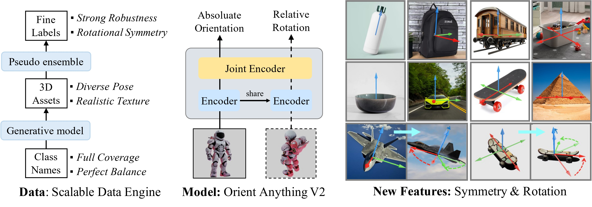

<div align="center">
<h1>[NeurIPS 2025 Spotlight]<br>
Orient Anything V2: Unifying Orientation and Rotation Understanding</h1>

[**Zehan Wang**](https://scholar.google.com/citations?user=euXK0lkAAAAJ)<sup>1*</sup> · [**Ziang Zhang**](https://scholar.google.com/citations?hl=zh-CN&user=DptGMnYAAAAJ)<sup>1*</sup> · [**Jialei Wang**](https://scholar.google.com/citations?hl=en&user=OIuFz1gAAAAJ)<sup>2</sup> · [**Jiayang Xu**](https://github.com/1339354001)<sup>2</sup> · [**Tianyu Pang**](https://scholar.google.com/citations?hl=zh-CN&user=wYDbtFsAAAAJ)<sup>2</sup> · [**Du Chao**](https://scholar.google.com/citations?hl=zh-CN&user=QOp7xW0AAAAJ)<sup>2</sup> · [**Hengshuang Zhao**](https://scholar.google.com/citations?user=4uE10I0AAAAJ&hl&oi=ao)<sup>3</sup> · [**Zhou Zhao**](https://scholar.google.com/citations?user=IIoFY90AAAAJ&hl&oi=ao)<sup>1</sup>

<sup>1</sup>Zhejiang University&emsp;&emsp;&emsp;&emsp;<sup>2</sup>SEA AI Lab&emsp;&emsp;&emsp;&emsp;<sup>3</sup>HKU

*Equal Contribution


<a href='https://arxiv.org/abs/2412.18605'></a>
<a href='https://orient-anythingv2.github.io'></a>
<a href='https://huggingface.co/spaces/Viglong/Orient-Anything-V2'></a>
<a href='https://huggingface.co/datasets/Viglong/OriAnyV2_Train_Render'></a>
<a href='https://huggingface.co/datasets/Viglong/OriAnyV2_Inference'></a>
<a href='https://huggingface.co/papers/2412.18605'></a>
</div>

**Orient Anything V2**, a robust image-based object orientation estimation model. By training on 2M rendered labeled images, it achieves strong zero-shot generalization ability for images in the wild.



## News
* **2025-10-24:** 🔥[Paper](https://arxiv.org/abs/2412.18605), [Project Page](https://orient-anythingv2.github.io), [Code](https://github.com/SpatialVision/Orient-Anything-V2), [Model Checkpoint](https://huggingface.co/Viglong/OriAnyV2_ckpt/blob/main/demo_ckpts/rotmod_realrotaug_best.pt), and [Demo](https://huggingface.co/spaces/Viglong/Orient-Anything-V2) have been released!

* **2025-09-18:** 🔥Orient Anything V2 has been accepted as a Spotlight @ NeurIPS 2025!

## Pre-trained models

We provide xxxx:

| Model | Params | Checkpoint |
|:-|-:|:-:|
| Orient-Anything-V2 | 5.05 GB | [Download](https://huggingface.co/Viglong/OriAnyV2_ckpt/blob/main/demo_ckpts/rotmod_realrotaug_best.pt) |

## Quick Start

### 1 Dependency Prepraration

```bash
conda create -n orianyv2 python=3.11

conda activate orianyv2

pip install -r requirements.txt
```

### 2 Gradio App
Start gradio by executing the following script:

```bash
python app.py
```
then open GUI page(default is https://127.0.0.1:7860) in web browser.

or, you can try it in our [Huggingface-Space](https://huggingface.co/spaces/Viglong/Orient-Anything-V2)

### 3 Python Scripts
```python
import numpy as np
from PIL import Image
import torch
import tempfile
import os

from paths import *
from vision_tower import VGGT_OriAny_Ref
from inference import *
from app_utils import *

mark_dtype = torch.bfloat16 if torch.cuda.get_device_capability()[0] >= 8 else torch.float16
# device = 'cuda:0'
device = torch.device('cuda' if torch.cuda.is_available() else 'cpu')

if os.path.exists(LOCAL_CKPT_PATH):
    ckpt_path = LOCAL_CKPT_PATH
else:
    from huggingface_hub import hf_hub_download
    ckpt_path = hf_hub_download(repo_id="Viglong/Orient-Anything-V2", filename=HF_CKPT_PATH, repo_type="model", cache_dir='./', resume_download=True)

model = VGGT_OriAny_Ref(out_dim=900, dtype=mark_dtype, nopretrain=True)
model.load_state_dict(torch.load(ckpt_path, map_location='cpu'))
model.eval()
model = model.to(device)
print('Model loaded.')

@torch.no_grad()
def run_inference(pil_ref, pil_tgt=None, do_rm_bkg=True):
    if pil_tgt is not None:
        if do_rm_bkg:
            pil_ref = background_preprocess(pil_ref, True)
            pil_tgt = background_preprocess(pil_tgt, True)
    else:
        if do_rm_bkg:
            pil_ref = background_preprocess(pil_ref, True)

    try:
        ans_dict = inf_single_case(model, pil_ref, pil_tgt)
    except Exception as e:
        print("Inference error:", e)
        raise gr.Error(f"Inference failed: {str(e)}")

    def safe_float(val, default=0.0):
        try:
            return float(val)
        except:
            return float(default)

    az = safe_float(ans_dict.get('ref_az_pred', 0))
    el = safe_float(ans_dict.get('ref_el_pred', 0))
    ro = safe_float(ans_dict.get('ref_ro_pred', 0))
    alpha = int(ans_dict.get('ref_alpha_pred', 1))

    if pil_tgt is not None:
      rel_az = safe_float(ans_dict.get('rel_az_pred', 0))
      rel_el = safe_float(ans_dict.get('rel_el_pred', 0))
      rel_ro = safe_float(ans_dict.get('rel_ro_pred', 0))

      print("Relative Pose: Azi",rel_az,"Ele",rel_el,"Rot",rel_ro)

image_ref_path = 'assets/examples/F35-0.jpg'
image_tgt_path = 'assets/examples/F35-1.jpg' # optional

image_ref = Image.open(image_ref_path).convert('RGB')
image_tgt = Image.open(image_tgt_path).convert('RGB')

run_inference(image_ref, image_tgt, True)
```

## Evaluate Orient-Anything-V2 on Datasets


### Data Preparation
下载常识位姿，相对位姿和多方向性测试数据，并解压。
修改paths.py中的相关变量，使路径指向数据集目录和元数据文件。


### Evaluate with torch-lightning
To evaluate on test datasets, run the following code:

```shell
python eval_on_dataset.py
```

## Train Orient-Anything-V2

我们使用Hunyuan3D-2.0模型生成我们的训练数据。
Download Fully Generated Training Dataset.

[Train Dataset]()
为了完全存储这些数据，我们推荐你的服务器上至少拥有2TB的硬盘空间空余。

Training Code (Todo)

Data pipeline (Todo)

## Acknowledgement
We would like to express our sincere gratitude to the following excellent works: 
- [VGGT](https://github.com/facebookresearch/vggt)
- [Hunyuan3D-2.0](https://github.com/Tencent-Hunyuan/Hunyuan3D-2)
- [Blender](https://github.com/blender/blender)
- [rembg](https://github.com/danielgatis/rembg)


## Citation
If you find this project useful, please consider citing:

```bibtex

```